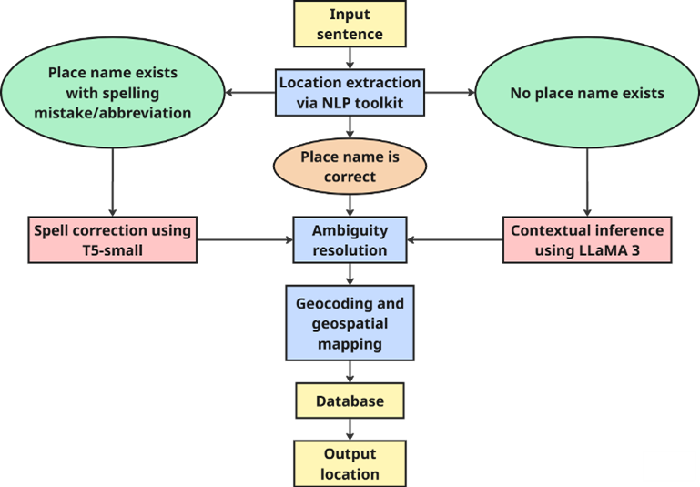

<div align="center">

# 🗺️ Smart Location Geocoding using Large Language Models

**A modular, transformer-powered pipeline for smart location rectification and geocoding from unstructured natural language — combining fine-tuned T5-small, LLaMA 3 contextual inference, and GeoNames-based geospatial grounding.**

[](https://python.org)
[](https://fastapi.tiangolo.com)
[](https://huggingface.co/docs/transformers/model_doc/t5)
[](https://ollama.com/library/llama3)
[](https://spacy.io)
[](LICENSE)

*Published research — Diya Maheshwari · Abhinav Vasudevan · Bharathi Ramudu · Narayan Panigrahi*  
*VIT Chennai · DRDO CAIR Bangalore*

</div>

---

## 📋 Table of Contents

- [Overview](#-overview)
- [Architecture](#-architecture)
- [Features](#-features)
- [Project Structure](#-project-structure)
- [Prerequisites](#-prerequisites)
- [Installation](#-installation)
- [Usage](#-usage)
- [API Reference](#-api-reference)
- [Models](#-models)
- [Data Sources](#-data-sources)
- [Performance Results](#-performance-results)
- [Examples](#-examples)
- [Configuration](#%EF%B8%8F-configuration)
- [Troubleshooting](#-troubleshooting)
- [Future Work](#-future-work)
- [Authors](#-authors)
- [Citation](#-citation)
- [Related Work](#-related-work)
- [License](#-license)

---

## 🔍 Overview

Location references in unstructured text — social media posts, disaster reports, user-generated content — are often noisy: misspelled (*"chnai"* → Chennai), abbreviated (*"blr"* → Bangalore), or purely implicit (*"Jallikattu is a traditional bull-taming sport"* → Madurai, Tamil Nadu). Traditional rule-based or dictionary-based systems fail on informal language, spelling errors, and overlapping place names.

This paper introduces a **novel unified framework** that addresses these challenges through a modular, transformer-powered pipeline performing location extraction, spell rectification, contextual inference, geocoding, and ambiguity resolution in a single end-to-end architecture.

The system processes any noisy input and returns:

1. **Extracts** location mentions using rule-augmented NLP and POS-tag filtering.
2. **Rectifies** misspelled or abbreviated names using a fine-tuned T5-small model.
3. **Infers** implicit locations from context using LLaMA 3 (e.g., *"robbery in biggest diamond market"* → Surat).
4. **Geocodes** to latitude, longitude, state, and district via local GeoNames data.
5. **Disambiguates** duplicate place names (e.g., *"Aurangabad"* in Bihar vs Maharashtra) using softmax-scored candidate ranking.
6. **Persists** all results to a local PostgreSQL database — fully offline, no external API calls.

**Target applications:** Disaster response, e-governance, postal automation, defence intelligence.

> **⚗️ Experiment Note:** The system was trained and evaluated on an **Indian dataset** as a proof-of-concept experiment. However, the entire pipeline is dataset-agnostic — it can be retrained on **any country's data** from [GeoNames.org](https://www.geonames.org/countries/). Simply download the corresponding country file (e.g., `US.txt`, `GB.txt`, `DE.txt`) and replace `IN.txt`, then retrain the T5 model on locally generated noisy address pairs.

> **🏆 Novelty:** To the best of the authors' knowledge, this is the **first unified architecture** to combine rectification, contextual inference, and disambiguation in a single, lightweight, end-to-end pipeline specifically optimised for noisy location data.

---

## 🏗️ Architecture



### Routing Decision Tree

| Condition | Route | Reason |
|---|---|---|
| Input exactly matches a known city in **one** state | Direct geocode | No correction needed |
| Input exactly matches a city in **multiple** states | LLaMA 3 | Needs contextual disambiguation |
| Short input (≤ 2 words) | T5 | Pattern-based correction |
| Contains abbreviation (e.g., `blr`, `hyd`) | T5 | Dictionary expansion + model correction |
| Contains spatial preposition (e.g., `near`, `in`) | T5 | Location extraction + correction |
| Everything else | LLaMA 3 | Full contextual inference |

---

## ✨ Features

- **Dual-Model Architecture** — Lightweight T5-small (60M params) for fast spell rectification; LLaMA 3 (8B params, 32 layers) for complex contextual reasoning.
- **Rule-Augmented NER** — POS-tag pipeline filters non-location entities before any model inference, ensuring clean model input.
- **Softmax Ambiguity Resolver** — Scores all GeoNames candidates and selects the highest-probability match when place names exist in multiple states.
- **22 Indian Abbreviations** — Built-in expansion for `BLR → Bangalore`, `DEL → Delhi`, `CHE → Chennai`, etc.
- **600K-Entry GeoNames Index** — Matches against ~6 lakh Indian place names for lat/lon, state, and district enrichment.
- **Fully Offline** — No external geocoding API calls; all data stored locally. Suitable for privacy-sensitive or infrastructure-constrained environments.
- **FastAPI Backend** — Async-ready REST API with Pydantic validation, CORS, and auto-generated OpenAPI docs.
- **PostgreSQL Logging** — Every correction is persisted with `input_text`, `model_used`, `corrected_location`, `latitude`, `longitude`, and `timestamp`.
- **500K+ Synthetic Training Records** — T5 trained on augmented noisy-to-correct pairs covering typos, abbreviations, and token reordering.
- **Fuzzy Matching** — Uses `rapidfuzz` (LLaMA 3 path) and `SequenceMatcher` (T5 path) for robust matching.
- **UTF-8 Resilient** — Full Unicode handling across all scripts and subprocesses.

---

## 📂 Project Structure

```
Auto_correct_address/
├── integrated.py                 # Central routing engine (T5 vs LLaMA3 vs direct)
├── T5_fine_tuned.py              # T5 model inference + geocoding
├── Context_mapping_LLAMA3.py     # LLaMA3 contextual inference + geocoding
├── train_t5.ipynb                # 🔁 Re-training notebook (Google Colab, run top-to-bottom)
├── backend/
│   └── main.py                   # FastAPI REST API server
├── t5_corrector_final/           # Fine-tuned T5 model weights
│   ├── model.safetensors         # Tracked via Git LFS (231 MB)
│   ├── spiece.model
│   ├── config.json
│   └── ...
├── IN.txt                        # GeoNames India locations (~600K entries, 66 MB)
├── admin1CodesASCII.txt          # State-level admin codes
├── admin2Codes.txt               # District-level admin codes
├── final_training_geocoded.csv   # ⚠️ Not in repo (73 MB) — training data only
├── .gitattributes                # Git LFS tracking rules
├── .env.example                  # Environment variable template (copy → .env)
├── requirements.txt              # Python dependencies
└── README.md
```

---

## � Data & Model Files

Large files are included in the repo but require **Git LFS**:

| File | Size | Notes |
|---|---|---|
| `t5_corrector_final/model.safetensors` | ~231 MB | Tracked via Git LFS |
| `IN.txt` | ~66 MB | GeoNames India dump — included directly |

When cloning, Git LFS must be installed for the model weights to download correctly:

```bash
# Install Git LFS once (if not already done)
git lfs install

# Then clone normally
git clone https://github.com/<your-username>/<repo>.git
```

`final_training_geocoded.csv` (training data, 73 MB) is **not** included — it is only needed to re-train the model via `train_t5.ipynb`.

---

## �📦 Prerequisites

| Dependency | Version | Purpose |
|---|---|---|
| **Python** | 3.11+ | Runtime |
| **PostgreSQL** | 12+ | Correction logging |
| **Ollama** | Latest | LLaMA 3 inference (optional) |

### Hardware Requirements

| Component | Minimum | Recommended |
|---|---|---|
| RAM | 4 GB (T5 only) | 8 GB (T5 + LLaMA 3) |
| Disk | 2 GB | 5 GB |
| GPU | Not required | CUDA GPU (faster T5 inference) |

> **Note:** LLaMA 3 requires ~6 GB RAM via Ollama. If unavailable, the system gracefully falls back to T5 or returns `"NA"`.

---

## 🚀 Installation

### 1. Clone the Repository

This repo uses **Git LFS** for the model weights (`model.safetensors`, 231 MB). Run `git lfs install` **once** before cloning, otherwise that file will download as a 134-byte pointer instead of the real weights.

```bash
git lfs install   # one-time setup on your machine
git clone https://github.com/<your-username>/Auto_correct_address.git
cd Auto_correct_address
```

### 2. Create a Virtual Environment

```bash
python -m venv venv
# Windows
venv\Scripts\activate
# macOS/Linux
source venv/bin/activate
```

### 3. Install Python Dependencies

```bash
pip install -r requirements.txt
```

### 4. Download spaCy Model

```bash
python -m spacy download en_core_web_sm
```

### 5. Set Up PostgreSQL

```sql
CREATE DATABASE "Address_corrector";

\c Address_corrector

CREATE TABLE corrections (
    id SERIAL PRIMARY KEY,
    input_text TEXT,
    model_used VARCHAR(50),
    output_text TEXT,
    latitude DOUBLE PRECISION,
    longitude DOUBLE PRECISION,
    created_at TIMESTAMP DEFAULT CURRENT_TIMESTAMP
);
```

> Create a `.env` file in the project root (copy from `.env.example`):
>
> ```ini
> DB_NAME=Address_corrector
> DB_USER=postgres
> DB_PASSWORD=your_postgres_password_here
> DB_HOST=localhost
> DB_PORT=5432
> ```
>
> Credentials are read via `os.getenv()` at runtime — never hardcoded in source.

### 6. (Optional) Install Ollama + LLaMA 3

```bash
# Install Ollama: https://ollama.com/download
ollama pull llama3
ollama serve   # Runs on http://localhost:11434
```

---

## 🎯 Usage

### Start the Backend

```bash
cd backend
python main.py
```

The FastAPI server starts at `http://localhost:5000`. Interactive docs are available at `http://localhost:5000/docs`.

### CLI Testing (Direct)

```bash
# Short input → T5
python integrated.py "blr"

# Contextual input → LLaMA3
python integrated.py "I visited the Taj in Agra last week"

# Ambiguous city → LLaMA3 with disambiguation
python integrated.py "Udaipur"

# Direct match → instant geocode
python integrated.py "Chennai"
```

---

## 📡 API Reference

### `POST /process_address`

Correct and geocode an address.

**Request:**

```json
{
  "address": "near blr"
}
```

**Response (`200 OK`):**

```json
{
  "corrected_address": "Bangalore",
  "latitude": 12.97194,
  "longitude": 77.59369,
  "district": "Bangalore Urban",
  "state": "Karnataka"
}
```

**Error Responses:**

| Code | Condition |
|---|---|
| `400` | Empty address field |
| `500` | Script execution or parsing failure |
| `504` | Processing timeout (>240 s) |

### `GET /health`

Liveness probe.

```json
{ "status": "ok" }
```

---

## 🤖 Models

### T5-Small (Fine-Tuned)

- **Base model:** `t5-small` — 60M parameters, encoder-decoder Transformer architecture.
- **Why T5-small:** Optimal balance between accuracy and computational cost. Comparable performance to T5-base (220M) and T5-large (770M) at a fraction of the resource requirement — compatible with limited-GPU and offline platforms.
- **Task:** Sequence-to-sequence location rectification. Training objective: cross-entropy loss minimisation over predicted vs. correct token sequences.
- **Training dataset:** `final_training_geocoded.csv` — 500,000+ synthetic noisy-to-correct Indian location pairs (fields: `noisy_location`, `correct_location`, `state`, `district`, `latitude`, `longitude`).
- **Training platform:** Kaggle — NVIDIA Tesla P100 GPU (16 GB VRAM).
- **Training config:** 2 epochs · batch size 8 · gradient accumulation 2 · Adam optimizer with weight decay · FP16 mixed-precision · early stopping on eval loss.
- **Tokenizer:** SentencePiece (vocabulary size 32,000) — handles subword-level noise (e.g., `"bengaloor"` → `"Bangalore"`).
- **Overfitting prevention:** Stratified sampling across states, data augmentation (mild + heavy noise), T5 built-in dropout, early stopping.
- **Training scope:** Fine-tuned on Indian data as an experiment, but the model **can generalise to other regions** with equivalent training data from [GeoNames.org](https://www.geonames.org/countries/).
- **Inference:** CPU-based, ~0.5–2 s per query after warm-up.
- **Weights:** Stored locally in `t5_corrector_final/` (`model.safetensors`, `spiece.model`, `tokenizer_config.json`).
- **Re-training:** Use [`train_t5.ipynb`](train_t5.ipynb) — a self-contained Google Colab notebook that re-trains from a fresh `t5-small` checkpoint. Upload `final_training_geocoded.csv` to Google Drive, open the notebook in Colab, set runtime to **T4 GPU**, and run all cells. The trained model is saved back to Drive as a drop-in replacement for `t5_corrector_final/`.

### LLaMA 3 (via Ollama)

- **Model:** `llama3` — 8B parameters, GPT-style decoder-only Transformer by Meta AI.
- **Architecture:** 32 layers · 8,192-token context window · open weights for easy offline deployment.
- **Interface:** HTTP API at `http://localhost:11434/api/generate`.
- **Three-stage contextual inference:**
  1. **Semantic reasoning** — captures cultural/contextual cues (e.g., *"Lord Jagannath"* → Puri).
  2. **Regional priors** — connects context to known landmarks (e.g., *"diamond market"* → Surat).
  3. **Candidate ranking** — when multiple locations are plausible, scores candidates using softmax-normalised probabilities and selects the highest.
- **Prompt format:** Structured prompt with strict output schema (Place / City / District / State).
- **Use case:** Implicit location inference, ambiguity resolution, long-form contextual inputs.
- **Inference:** ~3–10 s per query (CPU) · ~1–3 s (GPU).

---

## 🌍 Data Sources

| File | Source | Records | Description |
|---|---|---|---|
| `IN.txt` | [GeoNames](https://www.geonames.org/) | ~6 lakh (600K) | All Indian place names with `name`, `latitude`, `longitude`, `feature_class`, and admin codes |
| `admin1CodesASCII.txt` | GeoNames | — | State-level administrative codes and names |
| `admin2Codes.txt` | GeoNames | — | District-level administrative codes and names |
| `final_training_geocoded.csv` | Synthetic (custom) | 500K+ | Noisy-to-correct training pairs: `noisy_location`, `correct_location`, `state`, `district`, `latitude`, `longitude` |

### Synthetic Dataset Generation

The training dataset was built programmatically from GeoNames India data:

1. Extracted all `feature_class = 'P'` (populated places) entries from `IN.txt`.
2. Applied **stratified sampling** across Indian states and urban/rural diversity.
3. Introduced noise via **typos, abbreviations, and token reordering**.
4. Merged with `admin1` / `admin2` mappings for complete district and state labels.
5. Stored as `final_training_geocoded.csv` with 500,000+ records.

The same pipeline can be applied to any GeoNames country file (e.g., `US.txt`, `GB.txt`) to generate training data for other regions.

---

## � Performance Results

Evaluated on **2,000 synthetically generated test samples** emulating real-world noisy, abbreviated, and ambiguous city mentions.

### Per-Model Accuracy

| Model | Test Cases | Correct | Incorrect | Accuracy |
|---|---|---|---|---|
| T5-small | 1,100 | 808 | 292 | **73.45%** |
| LLaMA 3 | 600 | 492 | 108 | **82.00%** |
| Direct geocode | 300 | 288 | 12 | **96.00%** |
| **Total** | **2,000** | **1,588** | **412** | **79.40%** |

### Overall Metrics

| Metric | Score |
|---|---|
| **Accuracy** | 79.40% |
| **Precision** | 89.52% |
| **Recall** | 86.89% |
| **F1-Score** | 88.18% |

### Test Set Breakdown

| Category | Count |
|---|---|
| Ambiguous cases | 820 |
| Unambiguous cases | 1,180 |
| T5 path cases | 1,100 |
| LLaMA 3 path cases | 600 |
| Direct geocoded (valid + unambiguous) | 300 |
| True Positives (TP) | 1,538 |
| True Negatives (TN) | 50 |
| False Positives (FP) | 180 |
| False Negatives (FN) | 232 |

**Key observations:**
- The **Direct geocode path** achieves 96% accuracy — the highest reliability for valid, unambiguous inputs.
- **LLaMA 3** outperforms T5 on contextual disambiguation (82% vs 73.45%), handling implicit and semantically complex inputs more effectively.
- **T5** provides broader coverage, processing the most cases (1,100 of 2,000) at competitive accuracy.
- The **F1-score of 88.18%** demonstrates a strong balance between precision (correctness of predictions) and recall (coverage of true locations).

---

## �💡 Examples

| Input | Model Used | Output | State |
|---|---|---|---|
| `blr` | T5 | Bengaluru | Karnataka |
| `near hyd` | T5 | Hyderabad | Telangana |
| `floods in Chenai` | T5 | Chennai | Tamil Nadu |
| `rain in chnai` | T5 | Chennai | Tamil Nadu |
| `Bomb blast in hydrbad` | T5 | Hyderabad | Telangana |
| `Chennai` | Direct geocode | Chennai | Tamil Nadu |
| `Aurangabad` | LLaMA 3 (ambiguous) | Aurangabad | Maharashtra* |
| `Jallikattu is a traditional bull-taming sport` | LLaMA 3 | Madurai | Tamil Nadu |
| `robbery in biggest diamond market` | LLaMA 3 | Surat | Gujarat |
| `Devotees are blessed by Lord Jagannath` | LLaMA 3 | Puri | Odisha |

*\*Aurangabad and many Indian city names exist across multiple states; LLaMA 3 uses semantic context to select the most probable match.*

---

## ⚙️ Configuration

### Database

Edit `DB_CONFIG` in `T5_fine_tuned.py` and `Context_mapping_LLAMA3.py`:

```python
DB_CONFIG = {
    "dbname": "Address_corrector",
    "user": "postgres",
    "password": "your_password",
    "host": "localhost",
    "port": "5432",
}
```

### Ollama Endpoint

In `Context_mapping_LLAMA3.py`:

```python
OLLAMA_URL = "http://localhost:11434/api/generate"
OLLAMA_MODEL = "llama3"
```

### Subprocess Timeout

In `integrated.py`:

```python
SUBPROCESS_TIMEOUT = 180  # seconds
```

---

## � Future Work

Based on the paper's conclusions, the following extensions are planned:

- **Geospatially pre-trained models** — Evaluate [SpaBERT](https://arxiv.org/abs/2210.12213) (Li et al., 2022) as a geospatially aware alternative to T5 for location rectification.
- **Standard benchmarks** — Test on CoNLL-2003 NER benchmark and GeoNames evaluation sets for cross-domain validation.
- **Multilingual support** — Extend the pipeline to handle non-English and code-mixed location inputs (e.g., Hinglish).
- **Real-world disaster data** — Evaluate on live disaster-response datasets (social media feeds, incident reports).
- **Expanded GeoNames coverage** — Retrain on multi-country datasets to support international deployments beyond India.

---

## �🔧 Troubleshooting

| Problem | Solution |
|---|---|
| `LLaMA3 error: Connection refused` | Ensure Ollama is running: `ollama serve` |
| `LLaMA3 returns NA` | Model needs ~6 GB free RAM. Close other apps or use T5-only mode. |
| `T5 timeout on first run` | Cold start loads model into memory (~30 s). Subsequent calls are fast. |
| `Database Error: connection refused` | Start PostgreSQL and verify `DB_CONFIG` credentials. |
| `spaCy model not found` | Run `python -m spacy download en_core_web_sm` |
| `ModuleNotFoundError` | Install missing packages: `pip install <package>` |

---

## � Authors

| Name | Affiliation | Contact |
|---|---|---|
| **Diya Maheshwari** | School of Computer Science and Engineering, VIT Chennai | diyamaheshwari2412@gmail.com |
| **Abhinav Vasudevan** | School of Computer Science and Engineering, VIT Chennai | abhinav.vasudevan5@gmail.com |
| **Bharathi Ramudu** | Centre for Artificial Intelligence and Robotics, DRDO, Bangalore | bharathi.cair@gov.in |
| **Narayan Panigrahi** | Centre for Artificial Intelligence and Robotics, DRDO, Bangalore | pani.cair@gov.in |

---

## 📖 Citation

If you use this system or build upon this work, please cite the paper:

```bibtex
@article{maheshwari2025smartgeocoding,
  title     = {Smart Location Geocoding using Large Language Models},
  author    = {Maheshwari, Diya and Vasudevan, Abhinav and Ramudu, Bharathi and Panigrahi, Narayan},
  year      = {2025},
  institution = {VIT Chennai and DRDO CAIR Bangalore}
}
```

---

## 📚 Related Work

This project builds on ideas and tools from the following open-source projects and research:

| Project | Stars | Relevance |
|---|---|---|
| [libpostal](https://github.com/openvenues/libpostal) | 4.7k | International address NLP using CRF, trained on 1B+ addresses |
| [T5 (Google Research)](https://github.com/google-research/text-to-text-transfer-transformer) | 6.5k | Text-to-text transfer transformer — our T5 model's foundation |
| [HuggingFace Transformers](https://github.com/huggingface/transformers) | 157k | Model loading and tokenizer infrastructure |
| [spaCy](https://github.com/explosion/spaCy) | 33.2k | Industrial NLP — used for entity recognition and POS tagging |
| [geopy](https://github.com/geopy/geopy) | 4.8k | Python geocoding client — architectural inspiration |
| [pypostal](https://github.com/openvenues/pypostal) | 865 | Python bindings for libpostal address parsing |
| [Ollama](https://github.com/ollama/ollama) | 170k+ | Local LLM inference engine for LLaMA 3 |
| [GeoNames](https://www.geonames.org/) | — | Geographic database with 11M+ place names worldwide |
| [NLTK](https://github.com/nltk/nltk) | 13k+ | Natural language toolkit — POS tagging and tokenization |
| [RapidFuzz](https://github.com/rapidfuzz/RapidFuzz) | 2.8k+ | Fast fuzzy string matching for city name resolution |

### Key Papers Referenced

- **Maheshwari et al. (2025).** *Smart Location Geocoding using Large Language Models.* VIT Chennai & DRDO CAIR Bangalore.
- **Raffel et al. (2020).** *Exploring the Limits of Transfer Learning with a Unified Text-to-Text Transformer.* JMLR 21(140). [arXiv:1910.10683](https://arxiv.org/abs/1910.10683)
- **Touvron et al. (2023).** *LLaMA: Open and Efficient Foundation Language Models.* [arXiv:2302.13971](https://arxiv.org/abs/2302.13971)
- **Kudo & Richardson (2018).** *SentencePiece: A simple and language independent subword tokenizer and detokenizer for neural text processing.* [arXiv:1808.06226](https://arxiv.org/abs/1808.06226)
- **Li et al. (2022).** *SpaBERT: A pretrained language model from geographic data for geo-entity representation.* [arXiv:2210.12213](https://arxiv.org/abs/2210.12213)
- **Berragan et al. (2023).** *Transformer based named entity recognition for place name extraction from unstructured text.* International Journal of Geographical Information Science 37(4), 747–766.
- **Al-Olimat et al. (2017).** *Location name extraction from targeted text streams using gazetteer-based statistical language models.* [arXiv:1708.03105](https://arxiv.org/abs/1708.03105)
- **Honnibal & Montani (2017).** *spaCy 2: Natural Language Understanding with Bloom Embeddings, CNNs and Incremental Parsing.* [spacy.io](https://spacy.io)

---

## 📄 License

This project is licensed under the [MIT License](LICENSE).

---

<div align="center">

**Built for smart location intelligence — Indian dataset as experiment, any GeoNames country as target.**

*VIT Chennai · DRDO CAIR Bangalore*

</div>
